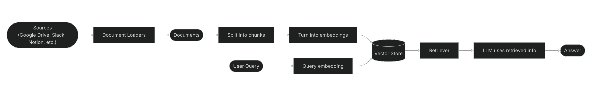

# Building a RAG Agent with LangChain

This repository outlines the core dependencies and architecture used in our Retrieval-Augmented Generation (RAG) and Large Language Model (LLM) applications.

Recently, the LangChain ecosystem underwent a major architectural shift to become more modular. Instead of a single monolithic package, integrations and core logic are now split into specialized packages. This improves dependency management, security, and integration updates.

---

## Architecture Overview

Our application follows the standard RAG pipeline, which enhances LLM capabilities by grounding them in your specific data.

### 1. Indexing

We load documents, split them into manageable chunks, and embed them into a vector database (ChromaDB) for long-term storage and efficient retrieval.

### 2. Retrieval

When a user query is received, the system queries the vector database to retrieve the most semantically relevant document chunks based on cosine similarity.

### 3. Generation

The retrieved chunks are fed into an LLM (OpenAI's GPT-4o) as context. The LLM then generates a precise response informed entirely by the retrieved data.



> **Reference:** [LangChain RAG Documentation](https://docs.langchain.com/oss/python/langchain/rag)

---

## Tech Stack Summary

| Package | Category | Primary Role |
| --- | --- | --- |
| `python-dotenv` | Environment | Secures API keys and environment variables. |
| `langchain` | Ecosystem | Orchestrates chains, agents, and higher-level logic. |
| `langchain-community` | Ecosystem | General hub for third-party loaders and tools. |
| `langchain_text_splitters` | Ecosystem | Chunks large texts into semantic segments. |
| `langchain_openai` | Partner | Powers the LLM generation and vector embeddings. |
| `langchain_chroma` | Partner | Stores embeddings and performs similarity searches. |

---

## Detailed Dependency Breakdown

Below is the breakdown of the packages powering our stack, their specific responsibilities, and how they are typically used in the codebase.

### Environment Management

#### `python-dotenv`

* **Role:** Environment variable manager.
* **Responsibilities:** Reads key-value pairs from a `.env` file and adds them to the Python application's environment variables (`os.environ`).
* **Typical Usage:** LLM and database applications require secure handling of API keys (like `OPENAI_API_KEY`) and connection strings. `python-dotenv` ensures these secrets are loaded into the application without hardcoding them into the source code.

**Example:**

```python
from dotenv import load_dotenv

# Loads variables from .env into the environment
load_dotenv()

```

---

### The LangChain Ecosystem

#### 1. `langchain`

* **Role:** The orchestration framework.
* **Responsibilities:** Contains the application-level logic that ties everything together. It houses the higher-level abstractions like Chains (chains of operations), Agents (LLMs deciding which tools to use), and overarching retrieval strategies. It builds upon `langchain-core` but does *not* contain specific third-party integrations.
* **Typical Usage:** Used to create conversational retrieval chains or reasoning agents.

**Example:**

```python
from langchain.chains import create_retrieval_chain
from langchain.chains.combine_documents import create_stuff_documents_chain

# Orchestrating the LLM and the Retriever
combine_docs_chain = create_stuff_documents_chain(llm, prompt)
retrieval_chain = create_retrieval_chain(retriever, combine_docs_chain)

```

#### 2. `langchain-community`

* **Role:** The general integration hub.
* **Responsibilities:** Houses thousands of third-party integrations (document loaders, lesser-used vector stores, web search tools, etc.) that do not yet have their own dedicated "partner package." It is maintained by the open-source community.
* **Typical Usage:** Used when you need to load data from specific sources (e.g., PDF loaders, Wikipedia loaders) or connect to tools that aren't major, standalone partners.

**Example:**

```python
from langchain_community.document_loaders import PyPDFLoader

loader = PyPDFLoader("document.pdf")
docs = loader.load()

```

#### 3. `langchain_text_splitters`

* **Role:** Document chunking utility.
* **Responsibilities:** Provides algorithms to split large documents into smaller, semantically meaningful chunks. This is a crucial step in RAG, as LLMs have context window limits, and vector databases perform better with targeted text sizes.
* **Typical Usage:** Used immediately after loading documents and before embedding them into a vector store.

**Example:**

```python
from langchain_text_splitters import RecursiveCharacterTextSplitter

text_splitter = RecursiveCharacterTextSplitter(
    chunk_size=1000,
    chunk_overlap=200
)
chunks = text_splitter.split_documents(docs)

```

---

### Partner Packages (Dedicated Integrations)

To prevent the core LangChain framework from becoming bloated and to allow updates to track closely with official SDKs, major providers now have their own dedicated "partner packages."

#### 4. `langchain_openai`

* **Role:** The intelligence and embedding engine.
* **Responsibilities:** Provides seamless, fully up-to-date integration with OpenAI's API. It contains the classes for OpenAI's chat models (`ChatOpenAI`) and embedding models (`OpenAIEmbeddings`).
* **Typical Usage:** Used to initialize the core LLM that generates responses and the embedding model that converts text into vector numbers for search.

**Example:**

```python
from langchain_openai import ChatOpenAI, OpenAIEmbeddings

# Initialize the embedding model for the vector DB
embeddings = OpenAIEmbeddings(model="text-embedding-3-small")

# Initialize the LLM for generation
llm = ChatOpenAI(model="gpt-4o", temperature=0)

```

#### 5. `langchain_chroma`

* **Role:** The Vector Database.
* **Responsibilities:** The dedicated integration for ChromaDB, a popular open-source vector database. It handles the storage of the document embeddings and performs the mathematical similarity searches (cosine similarity) to retrieve the most relevant chunks based on a user's query.
* **Typical Usage:** Used to ingest the chunks created by `langchain_text_splitters`, embed them using `langchain_openai`, and act as the `Retriever` in the final LangChain orchestration.

**Example:**

```python
from langchain_chroma import Chroma

# Store chunks in the vector database
vectorstore = Chroma.from_documents(
    documents=chunks,
    embedding=embeddings,
    persist_directory="./chroma_db"
)

# Use it as a retriever in a RAG chain
retriever = vectorstore.as_retriever(search_kwargs={"k": 3})

```

## Top 5 Text Chunking Strategies

### 1. CharacterTextSplitter

This is the simplest form of chunking. It splits the text based on a single, specific character (by default, a double newline `\n\n`) while trying to adhere to a maximum chunk size and an optional overlap.

* **How it works:** It looks for the designated separator and slices the text right there. If a chunk exceeds the maximum size, it just makes the cut at the character level.
* **Best for:** Simple, uniformly structured documents where paragraphs or lines are relatively consistent in length.
* **The Catch:** It is completely blind to context. If a paragraph is longer than your chunk size limit, it might split right in the middle of a sentence or a word, destroying the semantic meaning of that chunk.

---

### 2. RecursiveCharacterTextSplitter

This is LangChain’s recommended default text splitter for general text. It acts as a much smarter, more flexible version of the CharacterTextSplitter.

* **How it works:** Instead of a single separator, it uses a prioritized list of separators (usually `["\n\n", "\n", " ", ""]`). It tries to split by paragraphs first (`\n\n`). If a paragraph is still too large, it recursively moves to the next separator (sentences via `\n`, then words via spaces, then individual characters) until the chunk is under the size limit.
* **Best for:** General-purpose RAG applications, articles, and standard prose.
* **The Catch:** It relies heavily on standard punctuation. It does a great job keeping related text together, but it still relies on hard token/character limits rather than true meaning.

---

### 3. Document Specific Splitting

Different file types have distinct structures. Document-specific splitters understand the syntax of the language or format being used and split the text accordingly, rather than relying on standard punctuation. LangChain offers specific splitters for Markdown, Python, HTML, LaTeX, and more.

* **How it works:** A `MarkdownHeaderTextSplitter` chunks based on headers (e.g., `#`, `##`), keeping sections together. A `PythonCodeTextSplitter` chunks based on class and function definitions (`def`, `class`).
* **Best for:** Codebases, highly structured Markdown files, HTML pages, or legal contracts with distinct sections.
* **The Catch:** You need to know the exact format of your incoming documents beforehand, and it doesn't work well on mixed-format text.

---

### 4. Semantic Splitting

Semantic chunking moves away from character counts and syntax, focusing entirely on the *meaning* of the text. LangChain supports this natively through the `SemanticChunker`.

* **How it works:** It splits the document into sentences. It then uses an embedding model to calculate the semantic similarity between adjacent sentences. If two sentences are highly similar in meaning, they are grouped into the same chunk. When the similarity drops below a certain threshold (often calculated via percentile or standard deviation), it signifies a shift in topic and creates a new chunk.
* **Best for:** Complex documents with long-form ideas where context and nuance are critical, such as research papers or dense manuals.
* **The Catch:** It requires an embedding model to run *during* the chunking process, making it significantly slower and more computationally expensive than character-based splitters.

---

### 5. Agentic Splitting (Propositional/LLM-based)

This is the most cutting-edge strategy. Instead of relying on rules or basic embeddings, it uses a Large Language Model (an "agent") to intelligently break down the text into standalone statements or logical chunks.

* **How it works:** The LLM reads the text and rewrites or divides it into self-contained "propositions" (statements that hold a single fact or idea and make sense entirely out of context). LangChain facilitates this via experimental text splitters or custom extraction chains.
* **Best for:** High-accuracy enterprise RAG systems where retrieval precision is paramount and you cannot afford the retriever pulling in ambiguous, context-dependent sentences (like "He did it there.").
* **The Catch:** It is the slowest and most expensive method by far, as you are making a full LLM API call for every piece of text you ingest into your vector database.
